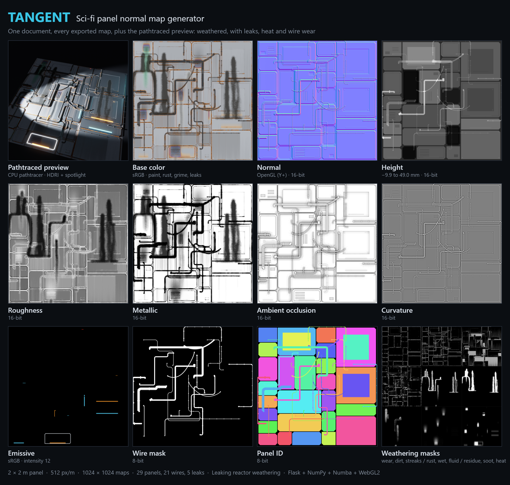

# Tangent

A browser-based normal map tool for sci-fi panels, served by Flask. Panels are
parametric: bevels, corners, grooves and details are stored in meters, so
resizing a panel never changes its edge treatment. A multi-threaded CPU
pathtracer renders a physically based preview under a sci-fi spotlight.



## Setup

Everything installs into the project venv `_env`. Nothing touches system Python.

```
python -m venv _env
_env\Scripts\python.exe -m pip install -r requirements.txt
_env\Scripts\python.exe -m pip install -r requirements-dev.txt   # tests only
```

## Run

```
_env\Scripts\python.exe app.py                          # http://127.0.0.1:5000
_env\Scripts\python.exe app.py --host 0.0.0.0 --port 8080   # serve on the LAN
```

`run.bat` does the first one. The first launch compiles the pathtracer, which
takes a few seconds. Numba caches the result for later runs.

## Tests

```
_env\Scripts\python.exe -m pytest
```

The wire simulation tests run under Node.js (`node --test tests/js/wiresim.test.mjs`);
pytest runs them too when Node is installed and skips them otherwise.

## Units

* Documents store every length in meters. The UI shows panel positions in cm
  and bevels, depths and details in mm.
* Texel density converts meters to pixels. The default is 512 px/m, with
  presets for 256, 1024 and 2048 px/m. Output resolution = canvas size × density.
* Every width field shows its pixel equivalent. A bevel, groove or detail
  bevel under 2 px is flagged because it will alias.

## Using it

| Action | How |
| --- | --- |
| Select, move | Click or drag a panel. Drag empty space to pan, wheel to zoom. |
| Resize | Drag a handle. Snaps to the grid; hold Alt to ignore it. |
| Draw a panel | `R`, then drag. It copies the selected panel's style. |
| Undo / redo | `Ctrl+Z` / `Ctrl+Y` |
| Duplicate, delete | `Ctrl+D`, `Delete` |
| Lock, hide | `L`, `H`. Locked panels survive auto-layout. |
| Stack order | `[` and `]` |
| Add a wire | `W`, then click start and end (Shift keeps the tool) |
| Nudge | Arrow keys, Shift for ×10 |
| Fit view | `F` |
| Orbit the render | Drag the render view, wheel to zoom, double-click to reset |

**Zoom detail.** The 2D view shows an overview of at most 1024 px across the
canvas. Zoom in further and the visible area is baked again at up to the full
texel density (never more than your screen can show) and drawn over the
overview, so higher densities are visible up close. The status bar shows the
patch size and density. Any edit drops the patch until the next bake, so it
never shows stale geometry. Exports always use the full density.

**Tiling.** Seamless mode is off by default, because a layout with a border or
seam already repeats cleanly. Turn it on when panels cross the canvas edge.
Their distance fields then wrap to the opposite side. Use *Tile ×3* in the
editor to check the seams.

**Environment (HDRI).** The pathtracer lights the panel with an equirectangular
HDRI plus the spotlights. Four procedural HDRIs ship built in: Dark hangar (the
default), Studio, Neon night and Overcast sky. They are generated on first use
and cached in `hdri/.cache/`. To add your own, drop Radiance `.hdr` files into
the `hdri/` folder or use *Upload .hdr* in the render settings. EXR is not
supported. Settings cover intensity, rotation, and the background (visible
HDRI by default, black, or blurred). The environment is importance-sampled and
combined with the material's own sampling, so bright strips and suns stay low
noise. With *Render lights* on, the editor view uses prefiltered versions of
the same HDRI.

**Lights (emission).** Details, inner grooves and panel faces can glow. Each
has a color (picker, swatches or color temperature) and a relative strength,
where 1 is about as bright as a white surface under the default spotlight.
Panel faces have a diffuser that fades the edges. Auto-layout adds light
strips, indicator dots, glowing grooves and light panels; set *Lights* to 0 to
turn that off. In the pathtraced view emitters really light the scene: their
light spills onto bevels, recesses, neighbors and the floor, shadowed by the
height field. In the realtime view emitters glow with bloom, and a baked,
blurred copy of the emission fakes the spill so nearby surfaces look lit.
*Scene light* in the render settings dims the spotlights and HDRI together.
Bloom is on by default in both views and has threshold, strength and radius
controls. The *Emissive* view mode shows the raw emission map.

**Wires.** Press `W`, click a start point and an end point (hold Shift to keep
adding). An end clicked on a panel attaches to it (nearest anchor plus an
offset), so it follows that panel when it moves or resizes; drag an end handle
to re-attach it. Each wire is either:

* *Simulated*: a rope that hangs under gravity, drapes over bevels, catches on
  details and, with *Collide* on, stacks on other wires. Use *Start / Pause /
  Resume / Step / Reset* in the left sidebar; while it runs you can drag a wire
  to pull it around. The gravity direction (default: down the image) and
  strength are set with the dial. The settled shape is saved in the document,
  so exports match what you saw. A wire whose panel moved is marked with an
  orange dot until it is re-simulated (or turn on *Auto settle*). Wires that
  have never been simulated, such as new auto-layout wires, settle on their own.
* *Routed*: a right-angle path (optionally with 45° runs) found by A* over the
  panels: it avoids raised details and bevel edges, prefers seams and grooves,
  minimises bends, and keeps clear of wires routed before it, so groups run in
  parallel. Bends are rounded to the bend radius.

Wires can be round tubes, ribbon cables or ribbed hoses, with connectors at the
ends, clips along the run, several parallel strands (a harness) and emission.
They have their own material in both previews (black rubber by default, see
*Wire material* in the render settings) and an optional *Wire mask* export.
New wires default to a 14 mm ribbed hose. Auto-layout adds a few wires of all
kinds (*Wires*, *Simulated* and *Harnesses* settings), and *Shuffle wires*
re-rolls only the wires on the current panels, keeping locked wires.
The simulation runs in the browser (`static/js/wiresim.js`); the server only
bakes the saved shapes. A height field cannot hold empty space under a wire, so
a wire spanning a gap reads as resting on the surface below it.

**Export.** The export dialog writes a zip with the normal map (OpenGL or
DirectX), height, AO, curvature, a panel ID mask and an emissive map as PNG,
plus the document JSON and an info file. The info file gives the height range
in millimeters and the emissive intensity to use in your engine, because the
emissive PNG is normalized so its brightest texel is white.

## Layout

```
app.py                  Flask routes; the pathtracer is optional
core/
  units.py              texel density, alias threshold
  sdf.py                rounded/chamfered box, circle, hexagon distance fields
  profiles.py           bevel profiles (linear, round, cove, smooth, ogee, stepped, custom)
  panel.py              Panel, Bevel, Groove, Detail (parametric, meters)
  document.py           canvas, density, tiling, panel stack, JSON
  layout.py             auto-layout (guillotine splits, symmetry, nesting, details, wires)
  wire.py               Wire model, endpoints, tube/ribbon/hose baking
  route.py              Manhattan A* wire routing (cached)
  bake.py               height -> normal, AO, curvature, ID, emissive (+ editor spill) maps
  filters.py            blur, bloom, sRGB helpers
  png.py                8/16-bit PNG writer
generators/
  base.py               Generator interface and pixel grid with wrap-around
  panels.py             panel stack compositor (future: water, ocean, flow)
render/
  presets.py            light and material presets (no Numba)
  hdri.py               .hdr reader, procedural HDRIs, sampling tables, editor prefiltering
  scene.py              builds pathtracer inputs from a document (no Numba)
  base.py               Renderer interface (future GPU backends)
  cpu.py, cpu_pathtracer.py   Numba CPU pathtracer, the only Numba code
  manager.py            background progressive render jobs
static/, templates/     editor UI (vanilla JS, WebGL2); js/wiresim.js is the wire simulation
tests/
```

If Numba is missing or fails to load, the editor, WebGL preview and exporters
keep working. The render pane then says the pathtracer is unavailable.

## License

MIT, see [LICENSE](LICENSE).
